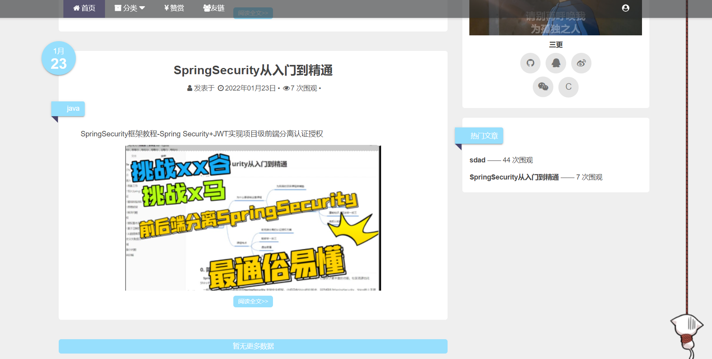

# Spring Boot 博客

本项目是一个基于 Spring Boot 的简单博客系统，主要用于学习和实践 Spring Boot 相关技术。

博客采用前后端离两套前端代码和两套后端代码

## 技术栈

- Spring Boot
- Spring Security
- MyBatis Plus
- Redis
- Vue 2
- JWT

## 功能

- 用户登录、注册
- 博客的增删改查
- 博客分类
- 博客评论
- 权限控制
- 使用AOP实现接口的日志打印
- 整合EazyExcel导出文章
- 七牛OSS文件存储
- 整合Knife4j实现接口文档的查看

## 快速开始

### 环境要求

- JDK 1.8 或更高版本
- Maven 3.2 或更高版本
- MySQL8.0或更高版本
- Redis 3.2 或更高版本

### 克隆项目

fork

```
git clone https://github.com/panther125/ginBlog.git
```

### 数据库配置

在 MySQL 中创建一个名为 `springboot_blog` 的数据库，并在 `application.properties` 文件中修改数据库相关配置。

```
spring.datasource.url=jdbc:mysql://localhost:3306/springboot_blog?useUnicode=true&characterEncoding=utf-8&useSSL=false&serverTimezone=Asia/Shanghai
spring.datasource.username=root
spring.datasource.password=password
```

### Redis 配置

在 `application.properties` 文件中修改 Redis 相关配置。

```
spring.redis.host=localhost
spring.redis.port=6379
spring.redis.password=
```

然后在浏览器中访问 http://localhost:9001即可访问博客系统。

## 运行项目

### 博客前台

* **vue-blog**

```bash
npm install
npm start
```

* BlogRun

```java
java -jar xxx.jar
```

## 博客后台

* **admin-vue**

```bash
npm i
npm run dev
```

* adminRun

```java
java -jar xxx.jar
```


## 项目截图




## 参考资料

- [Spring Boot 官方文档](https://spring.io/projects/spring-boot)
- [Spring Security 官方文档](https://spring.io/projects/spring-security)
- [MyBatis Plus 官方文档](https://mybatis.plus/)
- [Redis 官方文档](https://redis.io/documentation)
- [Vue 2 官方文档]()
- [三更草堂](https://www.bilibili.com/video/BV1hq4y1F7zk/?spm_id_from=333.337.search-card.all.click)

## 许可证

本项目采用 [MIT 许可证](https://chatmate.network/LICENSE)。
